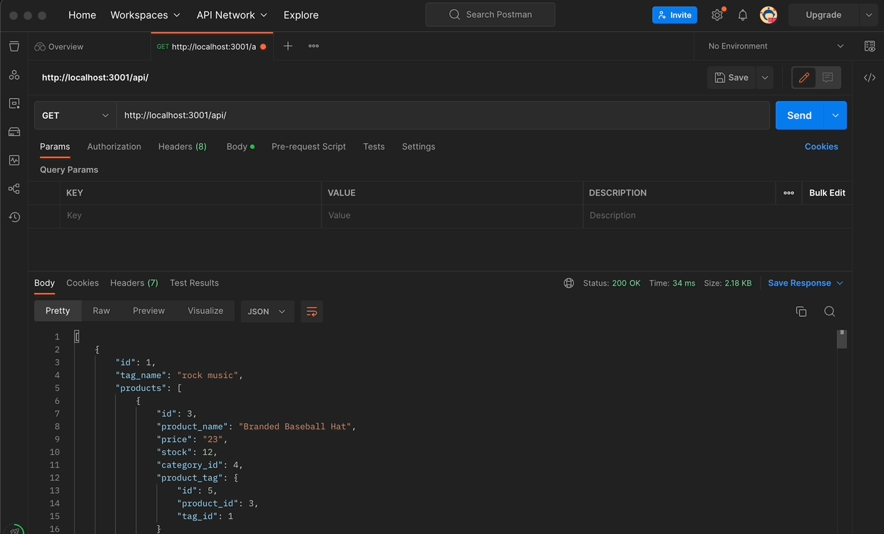
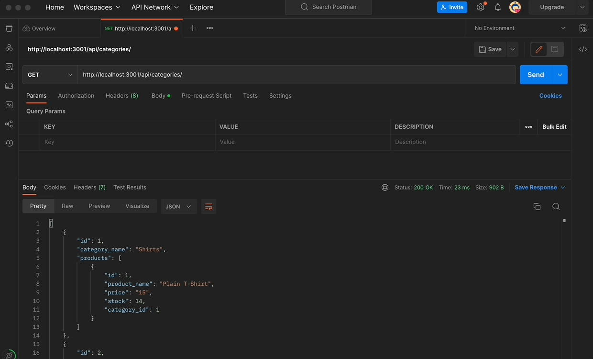

# SkynnByLandon E-Commerce (ORM)
  

  ## Table of Contents
  * [Description](#description)
  * [Installation](#installation)
  * [Usage](#usage)
  * [Contributors](#contributors)
  * [Test](#test)
  * [Questions](#questions)


  
* [License](#license)

    
  ## Description

  In this application, it mocks the back-end of an e-commerce business that is highly organized with its, products, tags, and inventory. This application uses Express.js, API, Sequelize, and MYSQL as the database.

  User Story

  ```md
  AS A manager at an internet retail company
  I WANT a back end for my e-commerce website that uses the latest technologies
  SO THAT my company can compete with other e-commerce companies
  ```

  Acceptance Criteria

  ```md
  GIVEN a functional Express.js API
  WHEN I add my database name, MySQL username, and MySQL password to an environment variable file
  THEN I am able to connect to a database using Sequelize
  WHEN I enter schema and seed commands
  THEN a development database is created and is seeded with test data
  WHEN I enter the command to invoke the application
  THEN my server is started and the Sequelize models are synced to the MySQL database
  WHEN I open API GET routes in Insomnia for categories, products, or tags
  THEN the data for each of these routes is displayed in a formatted JSON
  WHEN I test API POST, PUT, and DELETE routes in Insomnia
  THEN I am able to successfully create, update, and delete data in my database
  ```
  
  ## Installation
  To insatll pplication, in your terminal `npm run seed`, then `npm start`. You can then use Insomnia or Postman to get routes. 
  
  The following animation shows the application's GET routes to return all categories, all products, and all tags being tested in Postman:
  

  The following animation shows the application's GET routes to return a single category, a single product, and a single tag being tested in Insomnia:
  

  [Walkthrough Video](https://drive.google.com/file/d/1sxcxXv4QEA5ILaeFYAwnoSaoQXBwzy5h/view) 

  ## Usage
  Node.js, Express.js, Sequelize, & DotEnv
  ## Contributors
  Landon M.
  ## License
  MIT License
  ## Test
  undefined

  ## Questions
  * Github : [Landon Murray](https://github.com/LandoBM/)
  * E-Mail :landon.swdeveloper@gmail.com

  ## License
    Licensed using MIT License.
